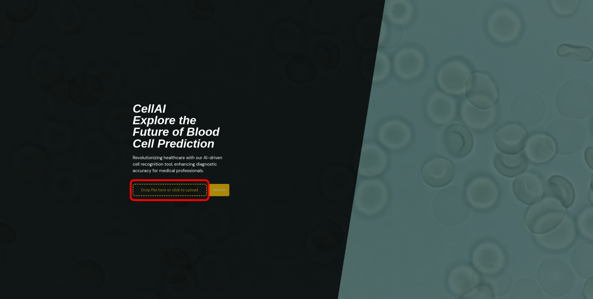
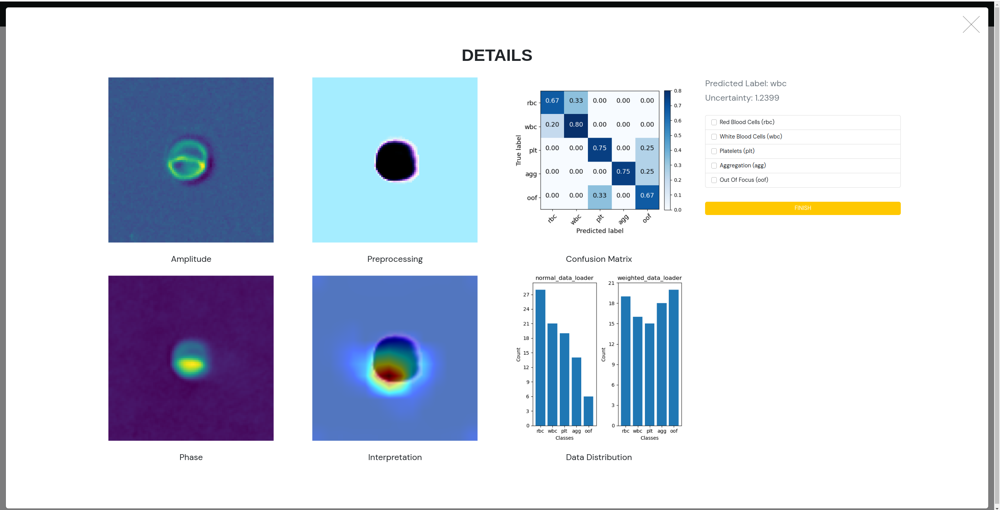
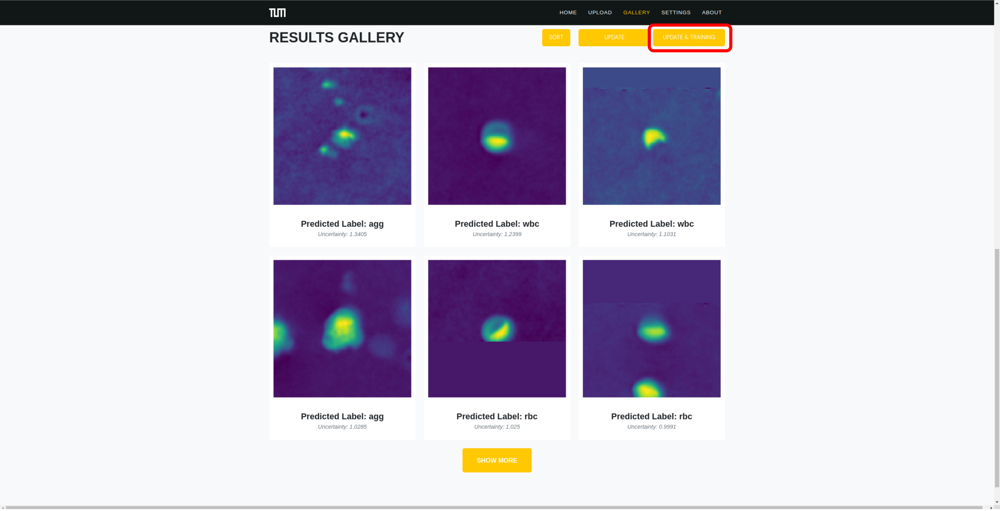

# Applied Machine Intelligence Project

It is the repository of the final project for Applied Machine Intelligence (SS23) at Technical University Munich.

## Team Member:
- **Huixu Liu** (Responsible for: Deployment)
- **Lei Zhang** (Responsible for: Active Learning)
- **Linghui Liu** (Responsible for: Web Inteface)
- **Mengqi Wei** (Responsible for: Calssification(DL-based Methods))
- **Yinjia Wang** (Responsible for: Classification(ML-based Methods), Web Interface)
- **Zihan Xu** (Responsible for: Segmentation, Web Interface)

## Introduction
This project aims to help clinicians to identify blood cell types. The main functions are segmentation, classification and active learning.

## Requirements

This project requires Python 3.9 or higher and uses the following Python packages:

- pytorch
- torchvision
- scikit-learn
- numpy
- matplotlib
- django
- openCV
- tqdm
- h5py

## User's Guide
> :computer: : work for **Windows**, **Linux** and **macOS**
>

To install the necessary packages, use pip:

```bash
pip install torch
pip install torchvision
pip install scikit-learn
pip install numpy
pip install matlabplot
pip install django
pip install opencv-python-headless
pip install tqdm
pip install h5py
```

**Remote Version**

The latest image is already available in the container registry and can be deployed to the remote k8s using flux.

First you need to:

- Getting the kubectl and flux clients
- Make sure you're in MWN (accessed from home using EduVPN)
- Set the KUBECONFIG environment variable to the configuration file kubeconfig_group02.yaml in the repository.

   1.install the flux tool locally 
   https://fluxcd.io/flux/installation/
   
   2.Use this command to set the environment variable
   ```bash
   $ export KUBECONFIG=kubeconfig_group02_group02.yaml
   ```
     This gives you operational access to the remote k8s.

   3.Then use the command line
   ```bash
   $ flux reconcile kustomization -n group02 group02 --with-source
   ```
     to configure the files under /deployment to the remote k8s.

   4.Use the URL 'https://cellai.group02.ami.dedyn.io/' to access the page opened on the remote.

**Local Version**

Reset to commit 232cfc46. Copy the 'inputs' and 'outputs' folders in ami project group share group02/model and replace the folders with the same names in the cloned repository Group02/app/web/src/model.

To run the Django server, switch to Group02/app/web/src, use the following command:
```bash
python manage.py runserver
```
Then open a web browser and navigate to http://127.0.0.1:8000/ to see the website in action.


In the homepage, upload a h5py file and wait for the prediction.



In the results gallery, click an image and modify the prediction label. Click `UPDATE & TRAINING` to retrain the model and predict.




